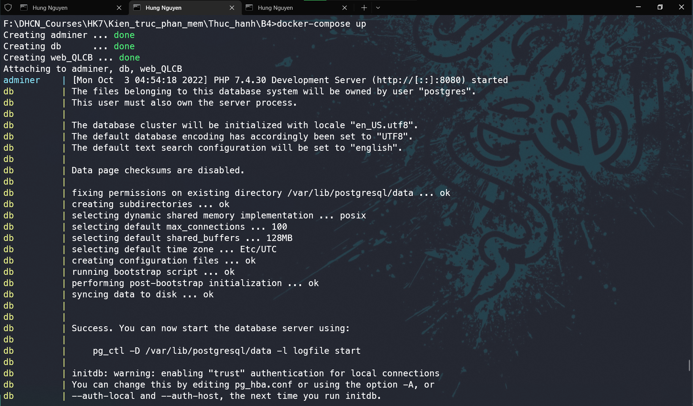
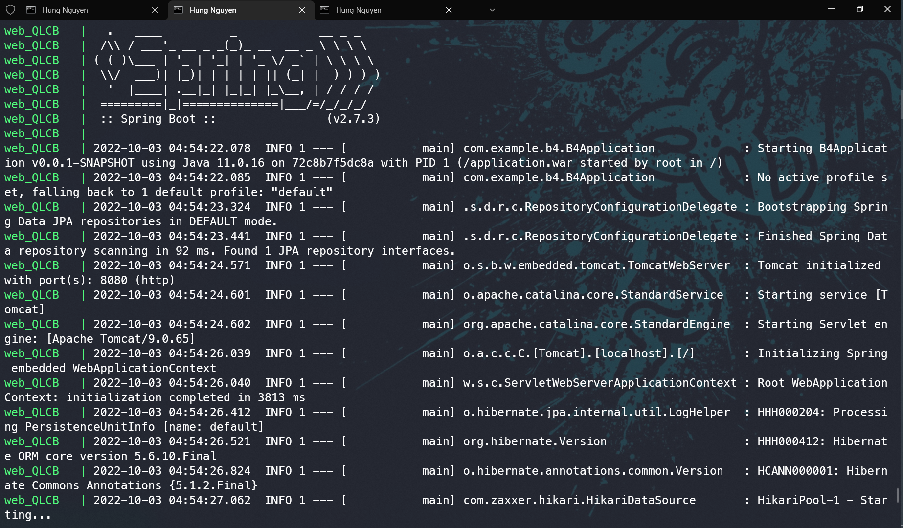
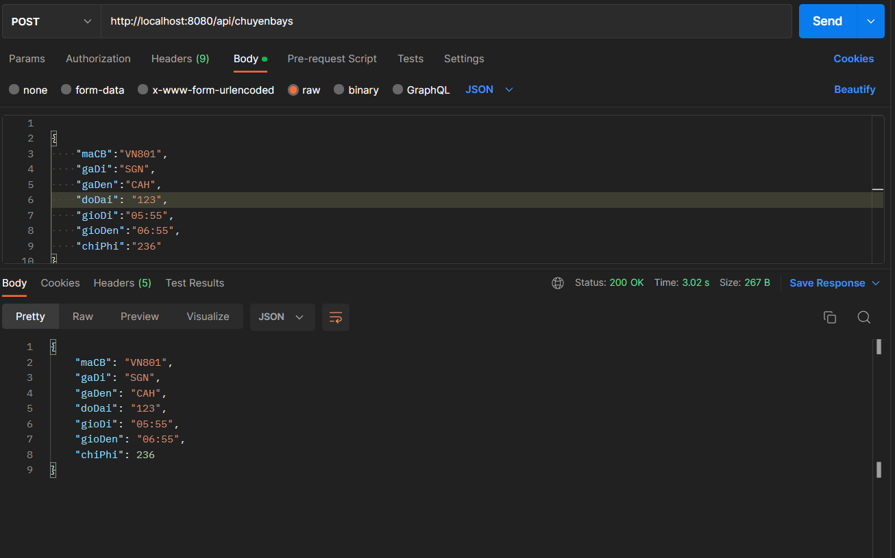
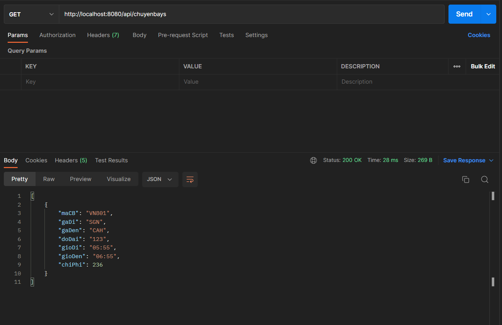
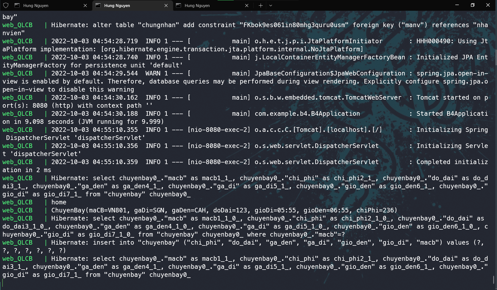

## Buổi thực hành 5

### Docker file build spring boot application

```
FROM openjdk:11
EXPOSE 8080
ARG DEPENDENCY=target/application.war
COPY ${DEPENDENCY} application.war
ENTRYPOINT ["java","-jar","/application.war"]
```

### Docker compose file

```
version: "2"

services:
  db:
    image: "postgres:latest"
    restart: always
    container_name: db
    volumes:
      - ./postgres-data:/home/postgreslocal/data
    working_dir: /home/postgreslocal

    ports:
      - "5432:5432"
    environment:
      - POSTGRES_USER=postgres
      - POSTGRES_DB=qlchuyenbay
      - POSTGRES_PASSWORD=example
  adminer:
    image: adminer
    container_name: adminer
    restart: always
    ports:
      - 8081:8081
  web:
    image: 'docker-spring-boot-postgres:latest'
    build:
      context: .
    volumes:
      - ./:/spring
    ports:
      - 8080:8080
    restart: always
    environment:
      - SPRING_DATASOURCE_URL=jdbc:postgresql://db:5432/qlchuyenbay
      - SPRING_DATASOURCE_USERNAME=postgres
      - SPRING_DATASOURCE_PASSWORD=example
      - SPRING_JPA_HIBERNATE_DDL_AUTO=update
    container_name: web_QLCB
    depends_on:
      - db
      - adminer
    links:
      - db
```

#### **Notes:** localhost -> [service name of database in docker compose]

    change:
        SPRING_DATASOURCE_URL=jdbc:postgresql://localhost:5432/qlchuyenbay
    to:
        SPRING_DATASOURCE_URL=jdbc:postgresql://db:5432/qlchuyenbay


<br>
<br>
<br>

<h4 style="color: #BBF895">Run docker compose</h4>




<h4 style="color: #BBF895">Create data in postman</h4>


<h4 style="color: #BBF895">Get data in postman</h4>


<h4 style="color: #BBF895">Console docker when create/get data</h4>



